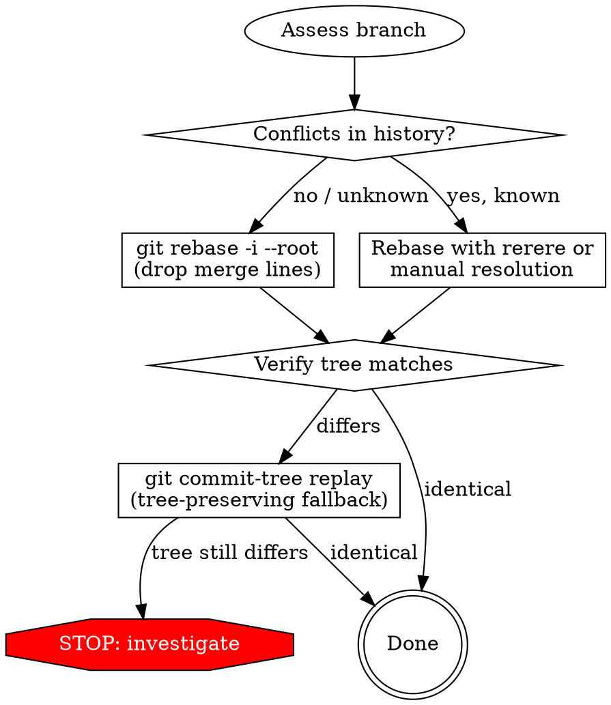

# Git Branch Linearizing

## Overview

Linearize a git branch with complex topological structure (merge commits from PRs, feature branches, etc.) into a clean single-parent chain. The final worktree must be byte-for-byte identical to the original HEAD, all actual work commits preserved, and zero merge commits remain.

**Core principle:** A merge commit is a structural join of two parent chains. Linearizing means replaying the actual work commits (non-merge) in topological order so the merge commits become unnecessary — their conflict resolutions are implicitly preserved by the replay order.

## When to Use

- Branch has merge commits you want eliminated (PR merges, feature branch merges)
- You need a clean linear history for bisect, cherry-pick, or export
- Preparing a branch for squash-based workflows
- Cleaning up before archiving or migrating repositories

**When NOT to use:**
- Branch has unresolved conflicts that would resurface (test first with `--dry-run` or on a throwaway branch)
- You need to preserve merge commit metadata as distinct events (use `git replace` instead)
- Shared branch with other developers actively pushing (coordinate first)

## Strategy Selection



## Quick Reference

| Method | Preserves Work Commits | Preserves Trees Exactly | Handles Conflicts | Complexity |
|--------|----------------------|------------------------|-------------------|------------|
| `rebase -i --root` (drop merges) | ✅ All non-merge commits | ✅ If no conflicts | ✅ Auto if clean | Low |
| `commit-tree` replay (first-parent) | ❌ Only mainline snapshots | ✅ Always | N/A (uses trees directly) | Medium |
| `rebase` + `rerere` | ✅ All non-merge commits | ✅ After resolution | Manual first time | High |
| Manual rebase from root | ✅ All non-merge commits | ✅ After resolution | Fully manual | Highest |

## Primary Method: Interactive Rebase Dropping Merges

**Best for:** Most repositories. Works when replaying non-merge commits in topological order doesn't produce conflicts (true for ~90% of repos with clean PR workflows).

### Pre-flight

```bash
# Record original state for verification and recovery
ORIGINAL_TREE=$(git rev-parse HEAD^{tree})
ORIGINAL_HEAD=$(git rev-parse HEAD)
git update-ref refs/backup/pre-linearize HEAD

# Count what we're working with
echo "Total commits: $(git rev-list --count HEAD)"
echo "Merge commits: $(git rev-list --count --merges HEAD)"
echo "Work commits:  $(git rev-list --count --no-merges HEAD)"
```

### Execute

```bash
# Drop all lines containing "Merge" from the rebase todo
# This removes merge commits; git replays only non-merge commits linearly
GIT_SEQUENCE_EDITOR="sed -i '' '/^pick.*Merge/d'" git rebase -i --root
```

**If sed pattern is too broad** (catches commits with "Merge" in non-merge messages), use a more precise filter:

```bash
# Only drop actual merge commits (2+ parents) by SHA
MERGE_SHAS=$(git rev-list --merges HEAD | tr '\n' '|' | sed 's/|$//')
GIT_SEQUENCE_EDITOR="sed -i '' -E '/^pick ($MERGE_SHAS)/d'" git rebase -i --root
```

**Alternative for newer git (2.38+):**

```bash
# git rebase automatically skips merge commits in non-interactive mode
git rebase --root
```

### Verification (MANDATORY)

```bash
# 1. Tree must be identical
NEW_TREE=$(git rev-parse HEAD^{tree})
[ "$NEW_TREE" = "$ORIGINAL_TREE" ] && echo "✅ Tree identical" || echo "❌ TREE DIFFERS"

# 2. Zero merge commits
MERGES=$(git rev-list --count --merges HEAD)
[ "$MERGES" -eq 0 ] && echo "✅ No merge commits" || echo "❌ $MERGES merges remain"

# 3. Diff against original (must be empty)
git diff HEAD refs/backup/pre-linearize --stat
# Should produce no output

# 4. All work commits present
echo "Work commits: $(git rev-list --count HEAD)"
# Should equal original non-merge count
```

### Decision-Point Tree Verification

HEAD matching is necessary but not sufficient. You must also verify that the tree at **each original merge decision point** is reproduced at the corresponding commit in the linearized history. This catches cases where HEAD is correct but intermediate states diverged and re-converged.

```bash
# For each original merge commit, find the equivalent commit in the new
# linear history (by matching the second parent's subject line), then
# compare tree SHAs.

PASS=0; FAIL=0; NOMATCH=0

for merge_sha in $(git rev-list --merges refs/backup/pre-linearize); do
    orig_tree=$(git rev-parse "${merge_sha}^{tree}")
    second_parent=$(git rev-parse "${merge_sha}^2")
    sp_subject=$(git log -1 --format='%s' "$second_parent")

    # Find the commit in new history with matching subject
    new_sha=$(git log HEAD --format='%H' --grep="$sp_subject" | head -1)

    if [ -n "$new_sha" ]; then
        new_tree=$(git rev-parse "${new_sha}^{tree}")
        if [ "$orig_tree" = "$new_tree" ]; then
            PASS=$((PASS+1))
        else
            FAIL=$((FAIL+1))
            echo "❌ FAIL at: $sp_subject"
            echo "   expected=$orig_tree got=$new_tree"
        fi
    else
        NOMATCH=$((NOMATCH+1))
        echo "⚠️  No match: $(git log -1 --oneline $merge_sha)"
    fi
done

echo "✅ Pass: $PASS | ❌ Fail: $FAIL | ⚠️ No match: $NOMATCH"
[ "$FAIL" -eq 0 ] && [ "$NOMATCH" -eq 0 ] && echo "All decision points verified."
```

**Why this matters:** The rebase method replays patches, so if all patches apply cleanly, intermediate trees are correct by construction. But if any patch was silently resolved differently (e.g., git's auto-resolution picked a different hunk order), the final tree could still match while intermediate states differ. This check catches that.

**When `--grep` misses commits:** If merge commit subjects are generic (e.g., "Merge branch 'develop'"), match by author date instead:

```bash
sp_adate=$(git log -1 --format='%aI' "$second_parent")
new_sha=$(git log HEAD --format='%H' --author-date-is="$sp_adate" | head -1)
```

### Recovery on Failure

```bash
# If rebase hits conflicts mid-way:
git rebase --abort

# If rebase completed but tree differs:
git reset --hard refs/backup/pre-linearize

# If you already deleted the backup ref:
git reflog  # Find the original HEAD SHA
git reset --hard <original-sha>
```

## Fallback: commit-tree Replay (First-Parent)

**Use when:** Rebase produces conflicts you can't resolve, OR you only care about mainline snapshots (not individual feature branch commits).

**Trade-off:** This preserves only the first-parent chain (mainline states). Feature branch commits that were merged in are lost — their combined effect is preserved as the merge commit's tree becomes a regular commit.

```bash
#!/bin/zsh
set -euo pipefail

COMMITS=($(git rev-list --first-parent --reverse HEAD))
PREV_NEW=""

for OLD_SHA in "${COMMITS[@]}"; do
    TREE=$(git rev-parse "${OLD_SHA}^{tree}")
    export GIT_AUTHOR_NAME=$(git log -1 --format='%an' "$OLD_SHA")
    export GIT_AUTHOR_EMAIL=$(git log -1 --format='%ae' "$OLD_SHA")
    export GIT_AUTHOR_DATE=$(git log -1 --format='%aI' "$OLD_SHA")
    export GIT_COMMITTER_NAME=$(git log -1 --format='%cn' "$OLD_SHA")
    export GIT_COMMITTER_EMAIL=$(git log -1 --format='%ce' "$OLD_SHA")
    export GIT_COMMITTER_DATE=$(git log -1 --format='%cI' "$OLD_SHA")
    MSG=$(git log -1 --format='%B' "$OLD_SHA")

    if [ -z "$PREV_NEW" ]; then
        NEW_SHA=$(printf '%s' "$MSG" | git commit-tree "$TREE")
    else
        NEW_SHA=$(printf '%s' "$MSG" | git commit-tree "$TREE" -p "$PREV_NEW")
    fi
    PREV_NEW="$NEW_SHA"
done

git update-ref refs/heads/$(git branch --show-current) "$PREV_NEW"
```

**Critical flaw of this method:** Former merge commits retain their "Merge pull request #N" messages but become single-parent commits. This looks misleading — the message says "merge" but structurally it's not. The actual feature branch commits are gone from history. Only use this when the rebase method fails.

## Fallback: Manual Rebase with Conflict Resolution

**Use when:** Rebase hits conflicts because feature branch commits don't apply cleanly without the merge resolution context.

```bash
# Enable rerere to learn conflict resolutions
git config rerere.enabled true

# Attempt rebase — resolve conflicts as they appear
GIT_SEQUENCE_EDITOR="sed -i '' '/^pick.*Merge/d'" git rebase -i --root

# On each conflict:
# 1. Check the original merge commit for resolution context
git show <original-merge-sha>  # See what the merge resolved to
# 2. Apply that resolution
# 3. git add . && git rebase --continue

# rerere remembers resolutions for future attempts
```

## Non-Starters: filter-repo / filter-branch

You might be tempted to script this with `git filter-repo` or `git filter-branch` (e.g., `--parent-filter` to strip second parents). **Don't.**

- `filter-branch --parent-filter` can rewrite parent pointers, but it doesn't replay patches — it just rewrites metadata. The resulting "linear" history has commits whose diffs no longer make sense against their new single parent. Trees are preserved but diffs between adjacent commits become nonsensical (massive spurious changes where a merge used to be).
- `git filter-repo` has the same fundamental problem. It operates on commit objects, not patch sequences. Stripping a parent pointer doesn't re-resolve the content against the new parent chain.
- Both tools give you commits that *look* linear but whose inter-commit diffs are broken. `git log -p` becomes useless. `git bisect` may point to wrong commits because the diff context is wrong.

**The only method that produces a truly coherent linear history is actually replaying patches:** `git rebase -i --root` with merge commits dropped. If conflicts arise, you resolve them one by one — that's the cost of a correct linearization. There is no shortcut that preserves both tree correctness AND diff coherence.

## Common Mistakes

| Mistake | Why It Fails | Fix |
|---------|-------------|-----|
| Using `filter-repo`/`filter-branch` to strip parents | Produces incoherent diffs between commits; trees are right but patch history is nonsensical | Use `rebase -i --root` — only patch replay produces coherent linear history |
| Using `commit-tree` on first-parent only | Drops all feature branch commits; keeps merge commit messages that now lie about structure | Use `rebase -i --root` to preserve actual work commits |
| Not verifying tree SHA after linearization | May silently produce different final state | Always compare `HEAD^{tree}` before and after |
| Forgetting backup ref before rewriting | No recovery path if something goes wrong | `git update-ref refs/backup/pre-linearize HEAD` first |
| Using `sed` pattern too broad for merge detection | Catches non-merge commits with "Merge" in message | Filter by actual merge commit SHAs (2+ parents) |
| Not checking remote state | Linearized local diverges from remote; force push needed | `git diff HEAD origin/branch --stat` to confirm content matches |
| Assuming `mapfile` works on macOS | bash 3.x on macOS lacks `mapfile` | Use zsh arrays or `while read` loops |
| Piping through `rtk`/wrappers that break on signals | SIGPIPE panics, broken pipe errors | Use native git commands for piped operations |
| Not verifying merge commits are structural | "Merge" in message ≠ merge commit; check parent count | `git cat-file -p <sha>` and count `parent` lines |

## Verification Checklist

After linearization, ALL must pass:

- [ ] `git rev-parse HEAD^{tree}` equals original tree SHA
- [ ] `git diff HEAD refs/backup/pre-linearize --stat` produces no output
- [ ] `git rev-list --count --merges HEAD` equals 0
- [ ] `git rev-list --count HEAD` equals expected (original non-merge count for rebase method)
- [ ] `git log --oneline --graph -10` shows straight line (no branching)
- [ ] No commits with "Merge" in message have 2+ parents: `git log --merges --oneline` is empty
- [ ] Decision-point tree verification passes: every original merge commit's tree is reproduced at the corresponding commit in the new history (see script above)

## Key Insight: What "Preserving Merge Decisions" Means

A merge commit's VALUE is its resolved tree — the state after combining two branches. When you linearize:

- **Rebase method:** Replays individual commits in order. If no conflicts arise, the final tree is identical — merge decisions are implicitly preserved because the patches apply cleanly in the same order.
- **commit-tree method:** Directly uses each commit's tree. Merge decisions are preserved as snapshots, but individual feature commits are lost.

The rebase method is superior because it preserves both the individual work AND the merge decisions (as the natural result of clean patch application).
